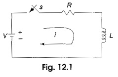
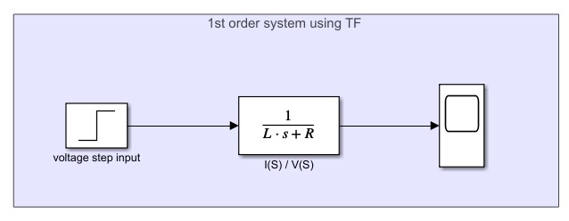
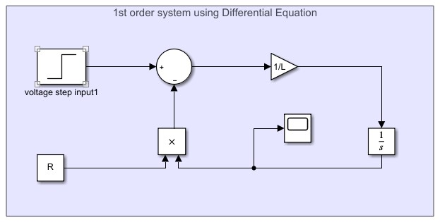
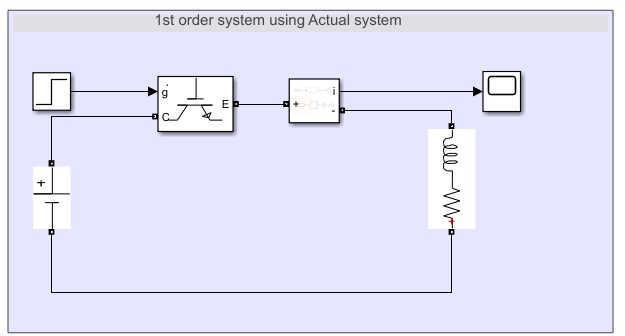
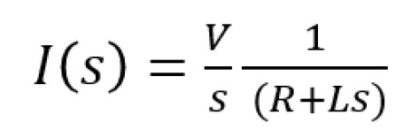
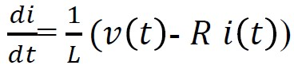

# Electrical Machines Dynamics

## **introduction**
in this repository, I'll put some electrical machines modeling and illustrate each of them
  - - - -
1. **first order system using RL**  
 
  

***Modeling this system can be done with a lot of approaches:-***
***types*** | Laplace  | Differential equation | Real system
| :--- | :--- | ---: | :---:
| ***images*** |  | |  
| ***Equations*** |  |  | Not needed here
